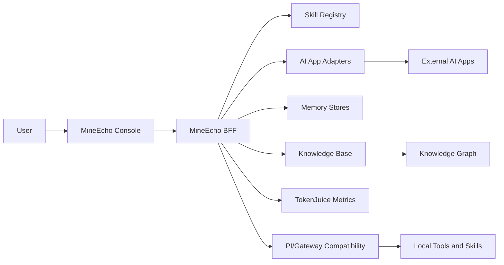

# Architecture Overview

MineEcho is a local-first assistant framework developed on top of capabilities from the OpenClaw PI framework. The default developer setup runs a browser Console and a local BFF. The BFF owns runtime state, skill routing, AI app adapters, memory, knowledge-base APIs, and the PI/Gateway compatibility layer.

## Runtime Shape

## Console

The Console is the local user interface. It serves chat, Skill Center, AI Apps, Memory, Knowledge Base, Knowledge Graph, configuration, and operational pages.

In development it runs on `http://127.0.0.1:5175/` and proxies `/api` to the BFF. Local login is not forced unless `VITE_MINEECHO_AUTH_REQUIRED=true`.

## BFF

The BFF is the local control plane. It defaults to `http://127.0.0.1:3085/` and coordinates:

- request routing from Console pages;
- skill import, normalization, trigger refresh, and route preview;
- AI app registration and conversion into skill-like callable units;
- memory and user-profile persistence;
- knowledge-base import, task tracking, graph consistency, and graph neighborhood APIs;
- TokenJuice metrics and cost-control settings;
- Gateway-compatible tool execution.

Runtime data belongs under local ignored directories such as `apps/bff/.mineecho/`, `apps/bff/.openclaw/`, and `apps/bff/workspace/`.

## PI/Gateway Compatibility Layer

MineEcho adds product layers for memory, knowledge, AI apps, and TokenJuice, while still reusing Gateway-related packages and protocol capabilities from the OpenClaw PI framework for skill execution, tool calls, and existing behavior bridging.

OpenClaw/Gateway names may still appear inside protocol adapters, package integration code, and compatibility config paths. These names are lower-level compatibility details. They should not be renamed without a migration plan because existing skill and tool integrations may depend on them.

## Skill and AI App Routing

Imported skills and registered AI apps enter the same routing surface:

1. The user asks a question in chat.
2. MineEcho scores available skills and AI-app-backed skills using triggers, name, description, mode, and routing evidence.
3. The best candidate can be called through the Gateway-compatible execution path.
4. Results return to chat with status feedback and error detail where available.

This keeps AI apps from becoming a separate silo and lets them participate in the same navigation and routing model as native skills.

## Memory and Knowledge

The current implementation separates reviewable memory and imported knowledge:

- memory stores user preferences, profile facts, interaction summaries, and working context;
- the knowledge base stores imported documents, wiki-like files, graph nodes, graph edges, import tasks, and consistency metadata;
- memory-to-knowledge alignment can preview and commit candidate links.

The planned direction is background consolidation: summarize older memories, abstract stable concepts, align them with imported knowledge, and surface conflicts or gaps for user review.

## TokenJuice and Cost Controls

TokenJuice is the cost-awareness layer. It tracks compression and usage metrics locally, while BFF settings keep output token limits, timeouts, rate limits, and cache sizes explicit. The long-term goal is a budget-aware routing policy that chooses memory depth, model size, and retrieval scope based on task value and user preference.

## Open-Source Boundaries

Before publishing:

- keep runtime data, credentials, and provider keys out of the source tree;
- run `npm run verify` for build and focused tests;
- run `npm run smoke` with local services running;
- run `npm run check:release` from a clean export or fresh clone.
