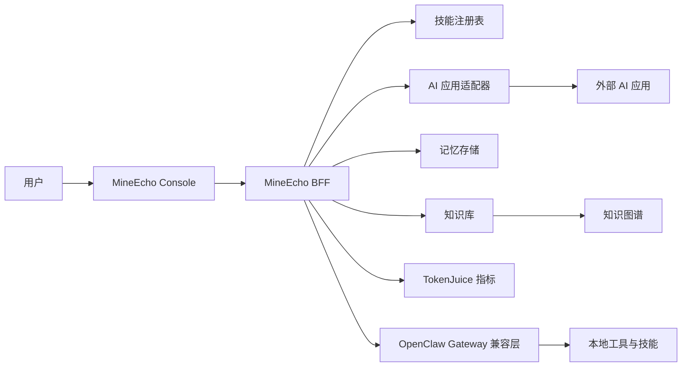

# 架构总览

MineEcho 是一个本地优先的 AI 助手框架。默认开发形态由浏览器 Console 和本地 BFF 组成。BFF 负责运行态数据、技能路由、AI 应用适配、记忆、知识库 API，以及 OpenClaw Gateway 兼容层。

## 运行结构

## Console

Console 是本地用户界面，承载聊天、技能中心、AI 应用、记忆、知识库、知识图谱、配置和运维类页面。

开发环境默认运行在 `http://127.0.0.1:5175/`，并将 `/api` 代理到 BFF。本地不会强制登录，除非设置 `VITE_MINEECHO_AUTH_REQUIRED=true`。

## BFF

BFF 是本地控制平面，默认运行在 `http://127.0.0.1:3085/`，负责协调：

- Console 页面的接口请求；
- skill 导入、规范化、触发词刷新和路由预览；
- AI 应用注册，并转换成类似 skill 的可调用单元；
- 记忆和用户画像持久化；
- 知识库导入、任务追踪、图谱一致性和图谱邻域 API；
- TokenJuice 指标和成本控制配置；
- Gateway 兼容的工具执行。

运行态数据应保存在被忽略的本地目录，例如 `apps/bff/.mineecho/`、`apps/bff/.openclaw/` 和 `apps/bff/workspace/`。

## Gateway 兼容层

MineEcho 在协议适配器、包集成代码和兼容配置路径中仍会出现 OpenClaw 命名。这些是实现细节。没有迁移计划时不应直接重命名，否则可能破坏现有 skill 和 Gateway 集成。

## Skill 与 AI 应用路由

导入的 skill 和注册的 AI 应用会进入同一个路由面：

1. 用户在聊天中提出问题。
2. MineEcho 根据 trigger、名称、描述、模式和路由证据为可用 skill 与 AI 应用 skill 打分。
3. 最匹配的候选可以通过 Gateway 兼容执行路径被调用。
4. 结果返回聊天界面，并尽可能展示状态反馈和错误细节。

这样 AI 应用不会成为孤立入口，而是和原生 skill 一起参与导航、推荐和调用。

## 记忆与知识库

当前实现把可审阅的记忆和主动导入的知识分开：

- 记忆保存用户偏好、画像事实、交互摘要和工作上下文；
- 知识库保存导入文档、类 wiki 文件、图谱节点、图谱边、导入任务和一致性元数据；
- 记忆到知识库的对齐支持候选预览和确认提交。

后续方向是后台整合：总结旧记忆、抽象稳定概念、与导入知识对齐，并把冲突或空白暴露给用户审阅。

## TokenJuice 与成本控制

TokenJuice 是成本感知层。它在本地追踪压缩和使用指标，同时 BFF 配置显式控制输出 token、超时、限流和缓存大小。长期目标是形成预算感知路由策略，根据任务价值和用户偏好选择记忆深度、模型大小和检索范围。

## 开源边界

发布前：

- 不要把运行态数据、凭据和 Provider Key 放进源码树；
- 运行 `npm run verify` 做构建和重点测试；
- 本地服务启动后运行 `npm run smoke`；
- 从干净导出或新 clone 中运行 `npm run check:release`。
